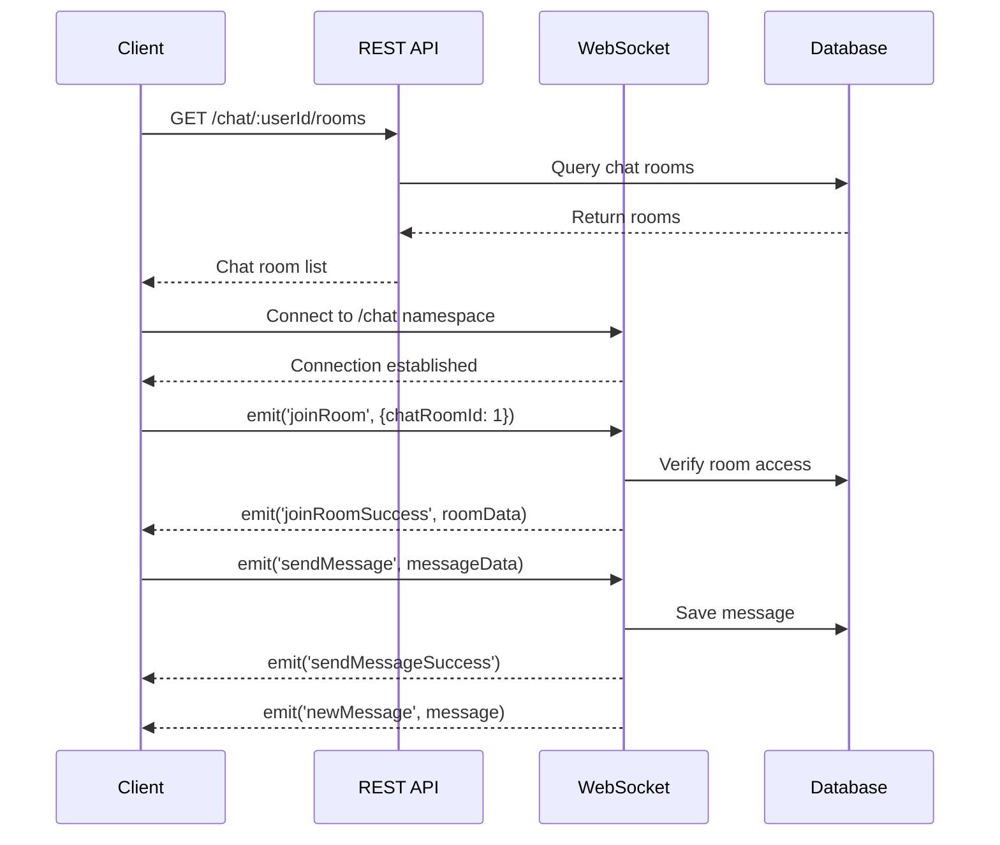
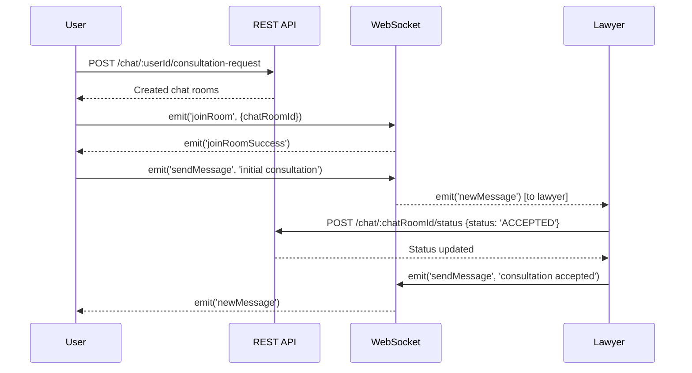
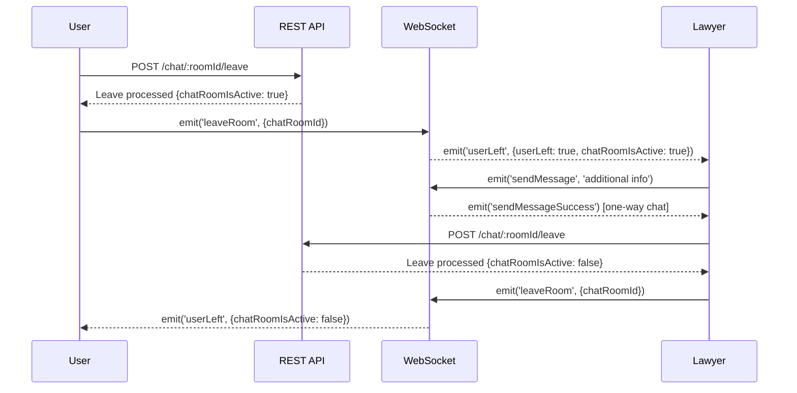

# 🔧 통합 테스트 시나리오

## 전체 플로우 테스트

### 1. 기본 채팅 플로우

#### 테스트 케이스
- [ ] 채팅방 목록 조회 → WebSocket 연결 → 채팅방 입장 → 메시지 전송
- [ ] 네트워크 끊김 → 자동 재연결 → 메시지 복구
- [ ] 다중 채팅방 전환 → 각 방별 메시지 동기화

### 2. 상담 요청 생성 플로우

#### 테스트 케이스
- [ ] 상담 요청 생성 → 다중 변호사에게 채팅방 생성
- [ ] 변호사 수락/거절 처리 → 상태 변경 알림
- [ ] 상담 진행 → 메시지 교환 → 완료 처리

### 3. 개별 나가기 플로우

#### 테스트 케이스
- [ ] 사용자 개별 나가기 → 일방향 채팅 상태 확인
- [ ] 변호사 추가 메시지 전송 → 사용자에게 알림 미전송 확인
- [ ] 양쪽 모두 나가기 → 채팅방 완전 종료

## 성능 테스트

### 부하 테스트
- [ ] 동시 사용자 1000명 채팅 테스트
- [ ] 초당 메시지 1000개 처리 테스트
- [ ] 메모리 사용량 모니터링

### 확장성 테스트
- [ ] 채팅방 수 증가에 따른 성능 변화
- [ ] 메시지 히스토리 크기와 로딩 성능
- [ ] 다중 서버 환경에서의 메시지 동기화

## 보안 테스트

### 인증/인가 테스트
- [ ] 만료된 토큰으로 API 접근 시도
- [ ] 다른 사용자의 채팅방 접근 시도
- [ ] 권한 없는 상태 변경 시도

### 입력값 검증 테스트
- [ ] SQL 인젝션 시도
- [ ] XSS 스크립트 메시지 전송
- [ ] 대용량 메시지 전송 (DoS 시도)

## 장애 복구 테스트

### 네트워크 장애
- [ ] 클라이언트 네트워크 끊김 → 재연결 → 메시지 동기화
- [ ] 서버 간 네트워크 분할 → 데이터 일관성 확인

### 서버 장애
- [ ] WebSocket 서버 재시작 → 클라이언트 자동 재연결
- [ ] 데이터베이스 장애 → 에러 처리 및 복구

### 브라우저 장애
- [ ] 브라우저 탭 종료 → 재접속 시 상태 복구
- [ ] 모바일 앱 백그라운드 → 포어그라운드 복귀 시 동기화

## 크로스 플랫폼 테스트

### 브라우저 호환성
- [ ] Chrome, Firefox, Safari, Edge
- [ ] 모바일 브라우저 (iOS Safari, Android Chrome)

### 디바이스 테스트
- [ ] 데스크톱, 태블릿, 모바일
- [ ] 다양한 화면 크기 및 해상도
- [ ] 터치 및 키보드 입력

## 모니터링 및 로깅

### 메트릭 수집
- [ ] API 응답 시간
- [ ] WebSocket 연결 수
- [ ] 메시지 전송 성공률
- [ ] 에러 발생률

### 로그 분석
- [ ] 에러 로그 패턴 분석
- [ ] 사용자 행동 패턴 분석
- [ ] 성능 병목 지점 식별

### 알림 설정
- [ ] 에러율 임계값 초과 시 알림
- [ ] 응답 시간 지연 알림
- [ ] 서버 리소스 사용률 알림